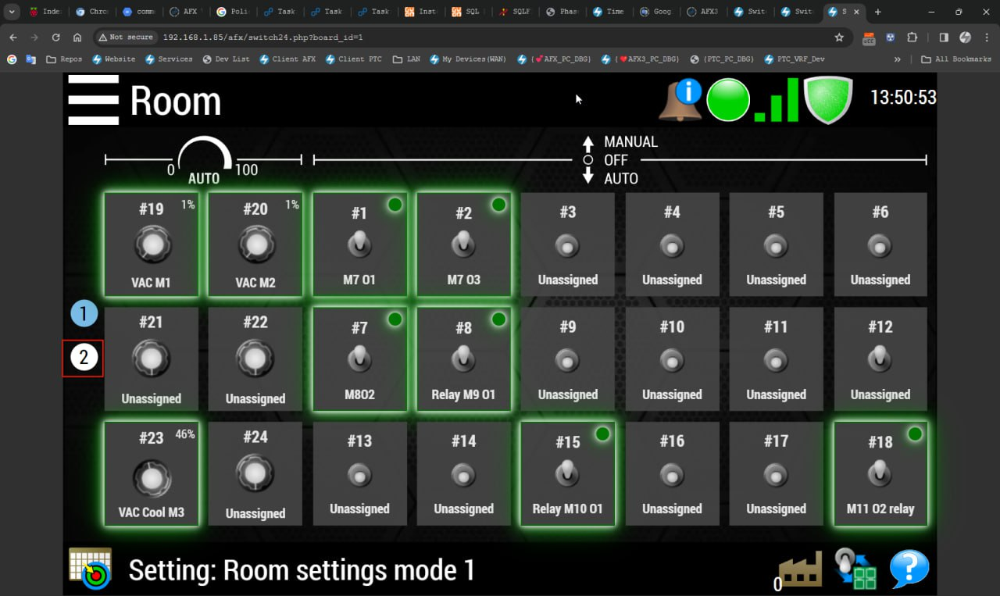
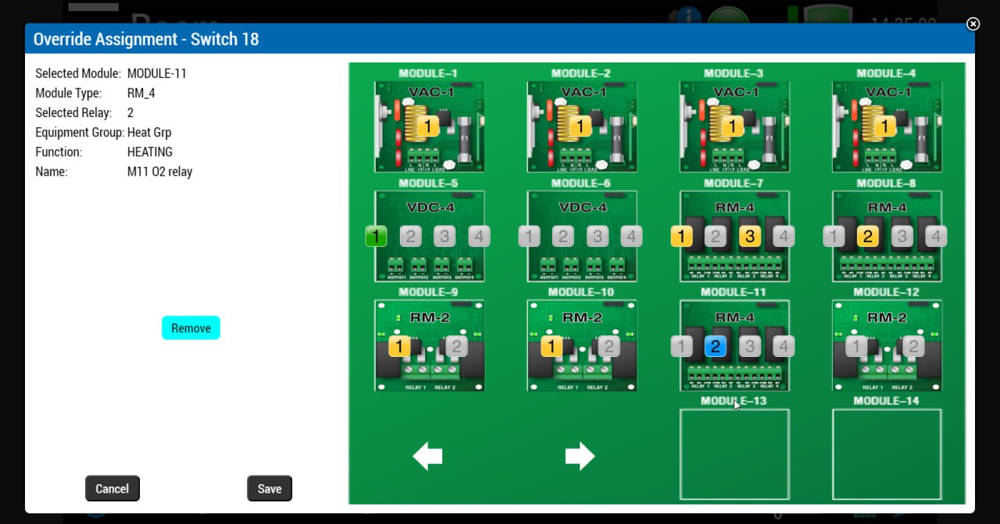

# Switch24 Control Interface — Full-Stack Portfolio Demo

A portfolio excerpt from an industrial control-system interface for configuring a 24-switch hardware panel. The project demonstrates how I translate complex hardware rules and relational data into a clear, interactive web experience.

> This repository contains selected portfolio files rather than a standalone application. Production dependencies, shared assets, database schema, and proprietary services are intentionally not included.

## Interface Preview

| 24-switch overview | Module and relay configuration |
|---|---|
|  |  |

## What the Interface Does

- Visualizes 24 configurable switches across two switchboards.
- Maps switches to main-board and expansion-board hardware modules.
- Represents available, occupied, unavailable, and selected port states.
- Enforces compatibility rules between switch types, modules, and relay ports.
- Loads live hardware configuration and equipment metadata from PostgreSQL.
- Supports assigning, updating, and removing switch-to-port bindings.
- Adapts the module view between compact and expanded layouts.
- Applies role-based restrictions to configuration actions.
- Supports localized interface text through an i18n workflow.

## Featured Source Files

### [switch24.php](./switch24.php)

The primary 24-switch dashboard. It combines server-rendered PHP with a highly structured CSS Grid layout and client-side behavior to present switch state, equipment groups, relay functions, and configuration status.

**Demonstrated skills:** complex UI composition, state-driven rendering, PHP integration, responsive layout strategy, DOM manipulation, and asynchronous data loading.

### [switch24-modal.php](./switch24-modal.php)

The interactive configuration workflow. It models 28 hardware modules, multiple module types, per-port capability rules, main/expansion panels, selection state, and save/remove operations.

**Demonstrated skills:** domain modeling, hardware-aware business rules, UI state management, event-driven JavaScript, AJAX persistence, access control, and internationalization.

## Supporting Data Endpoints

- [getSwitch24Info.php](./getSwitch24Info.php) assembles switch, module, port, and equipment-group data into a JSON response.
- [getSwitchKnobs.php](./getSwitchKnobs.php) returns board-specific switch assignments and normalized I/O descriptions.

The backend uses parameterized PostgreSQL queries for user-supplied values and combines data from relays, variable-speed outputs, inputs, RPM modules, zones, and switch mappings.

## Technical Highlights

| Area | Implementation |
|---|---|
| Front end | HTML5, CSS Grid, Flexbox, JavaScript, jQuery, jQuery UI |
| Back end | PHP, JSON endpoints, server-side sessions |
| Database | PostgreSQL, parameterized queries, multi-table joins and unions |
| Interaction | AJAX-based loading and persistence, modal workflows |
| State model | Module capability maps, port status transitions, board-aware bindings |
| Product concerns | Role-based controls, localization hooks, compact/expanded views |

## Engineering Approach

This work shows my ability to operate across the full stack: understand a hardware domain, model its constraints, design an operator-facing interface, integrate it with relational data, and implement the complete interaction flow. The result is not a static mockup—it is a data-driven control surface built around real configuration rules.

## Repository Structure

```text
.
├── switch24.php             # Main 24-switch dashboard
├── switch24-modal.php       # Module/relay configuration workflow
├── getSwitch24Info.php      # Aggregated configuration API
├── getSwitchKnobs.php       # Board switch and I/O API
├── Phason1.jpg              # Dashboard screenshot
└── Phason2.jpg              # Configuration screenshot
```

## About the Developer

Built by [Nemo Wang](https://github.com/NemoAng), a full-stack and IoT-focused software developer experienced in connecting web interfaces, backend services, databases, and hardware-oriented business logic.
